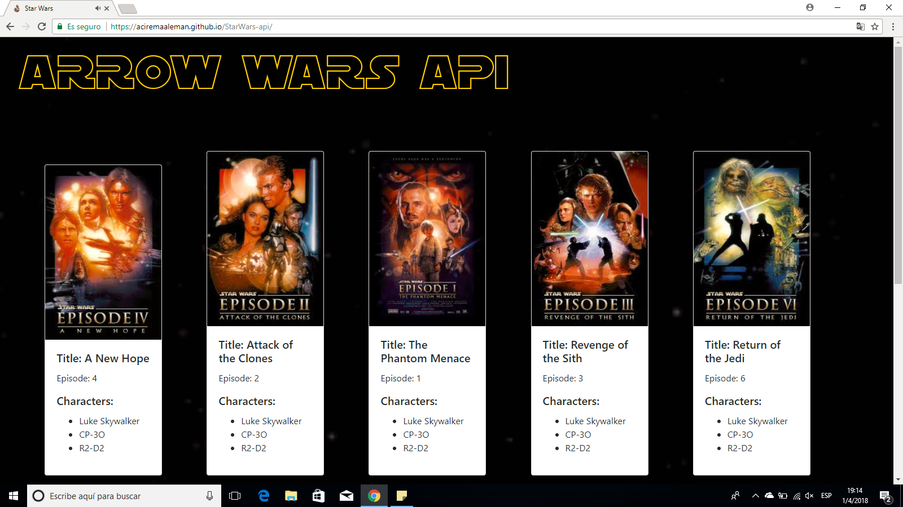

# StarWars-api

In this project I used de Api SWAPI, to gives the information about the movies of Star Wars.

https://swapi.co/

The challenge of this api was create the modal whit the characters information and put images of the characters, also enter to the data of this Api SWAPI.

The api fetch provides you an interface of javascript to enter and manipulate the data of the Api SWAPI in this case also i used the programming language javascript ecma6 and the framework of css boostrap, the audio of html5.

project made for laboratoria
